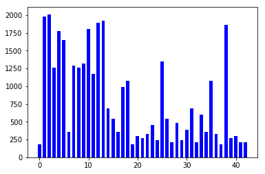
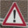

#**Traffic Sign Recognition** 

##Writeup

---

**Build a Traffic Sign Recognition Project**

The goals / steps of this project are the following: 

* Load the data set
* Explore, summarize and visualize the data set
* Design, train and test a model architecture
* Use the model to make predictions on new images
* Analyze the softmax probabilities of the new images
* Summarize the results with a written report

---
###Writeup / README

With my [project code](https://github.com/markusbrn/CarNDTrafficSignsP1.git) I am performing the following steps:

###Data Set Summary & Exploration

First I am loading the test, training and validation data with pickle and then I am checking the number of training data samples for each traffic sign. It turns out that there are signs with less than 250 samples (e.g. 20km/h speed limit) while others have more than 2000 samples. The number of images in the training data for the different sign types  can be seen in the figure with the sign types on the x-axis and the corresponding number of samples on the y-axis.

###Design and Test a Model Architecture
####1. Augmentation of training data
For the signs with less than 750 samples, additional samples will be created in the following. For this I am using the function transform.AffineTransform followed by transform.warp from skimage. I am generating the values for rotation and shear from a random distribution between +/- 1/6[rad]. The blank areas of the transformed image I am filling with the function cv2.inpaint.
Once I have generated the training data set with a sufficient number of examples per sign type, I am trying to enhance the image quality to make it easier for the network to be trained. As some images are very dark, I am first converting them to grayscale and then use the function exposure.equalize_hist from skimage to enhance image quality. The overall approach is similar to the one presented in [https://navoshta.com/traffic-signs-classification/](https://navoshta.com/traffic-signs-classification/). Im am performing the procedure with all the training, validation and test data and I am saving the results with pickle.

####2. Model Architecture

My final model consists of the following layers:

| Layer         		|     Description                            | 
|:---------------------:|:------------------------------------------:| 
| Input         		| 32x32x1 grayscale image					 | 
| Convolution 5x5     	| 1x1 stride, valid padding, outputs 28x28x32| 
| RELU & DROPOUT    	| keep_prob for dropout as tf.placeholder	 | 
| Max pooling	      	| 2x2 stride,  outputs 14x14x32 			 | 
| Convolution 5x5     	| 1x1 stride, valid padding, outputs 10x10x64| 
| RELU & DROPOUT    	| keep_prob for dropout as tf.placeholder    | 
| Max pooling	      	| 2x2 stride,  outputs 5x5x64   			 | 
| Max pooling (layer1) 	| 2x2 stride,  outputs 7x7x32   			 | 
| Flatten (layer1)  	| inputs 7x7x32, outputs 1568      			 | 
| Flatten (layer2)  	| inputs 5x5x64, outputs 1600     			 | 
| Combine to fully conn.| inputs 3168, outputs 1000     			 | 
| RELU & DROPOUT    	| keep_prob for dropout as tf.placeholder    | 
| Fully connected		| outputs 400								 | 
| RELU & DROPOUT    	| keep_prob for dropout as tf.placeholder    | 
| Fully connected		| outputs number of sign types				 | 
| Softmax				| etc.        								 | 

####3. Model Training

To train the model, I am using a batch size of 256, and train for 200 epochs. I am setting the keep_prob function that I defined for the dropout function to a value of 0.8 during training and to 1.0 for validation and test. The logits at the output of the network are turned into probabilities by using the softmax function; the sign types are one-hot encoded. Then the softmax output is compared with the one-hot encoded sign labels by computing the softmax cross-entropy function. The goal during the training process of the network is to reduce the mean of the cross entropy function. In order to penalize large weights I am addding a regularization term to the computed cross entropy value. For the training of the network I am using the function tf.train.AdamOptimizer (the used learning rate is 0.001).

####4. Model Validation

With my final model I achieved a validation set accuracy of 0.985.
For this I used a structure similar to the one presented in [https://navoshta.com/traffic-signs-classification/](https://navoshta.com/traffic-signs-classification/). I did this as comparisons of various network topologies in [http://yann.lecun.com/exdb/publis/pdf/sermanet-ijcnn-11.pdf](http://yann.lecun.com/exdb/publis/pdf/sermanet-ijcnn-11.pdf) have shown that this network type gives a good performance. I mostly experimented with batch size and epochs. The epochs are currently set at 200 in my code which I think is too high as from the logging of the training process (cell 16 of my ipython notebook) it can be seen that the network reaches a validation accuracy of greater than 0.97 for the first time already after epoch 23.
 

###Test the Model on New Images

Here are five German traffic signs that I found on the web:

   
 

All images are quite nice so I do not expect any particular difficulties.
The results of the prediction were as follows::

| Image			        |     Prediction	        					|
|:---------------------:|:---------------------------------------------:|
| Keep Right      		| Keep Right   									|
| Yield     			| Yield 										|
| Priority Road			| Priority Road									|
| General caution  		| General caution				 				|
| Speed limit (20km/h)	| Speed limit (20km/h)							|

The model was able to correctly guess 5 of the 5 traffic signs, which gives an accuracy of 100%.

####3. Softmax Output of the network for the test signs

The code for making predictions on my final model is located in the 21st cell of the Ipython notebook.
In all cases the network is extremely sure that the sign is of a specific type (greater than 99%).